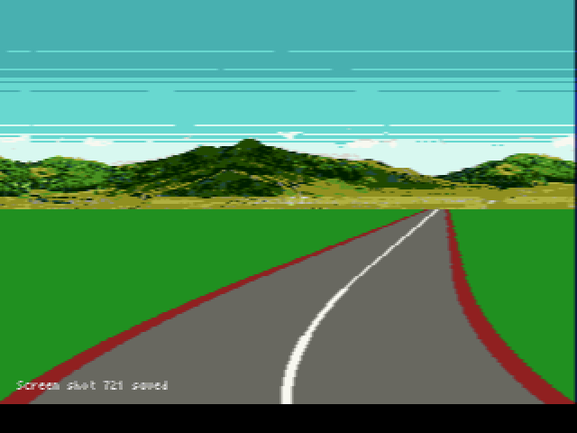

# Overview
This code is based on the [Curves and Steering](http://www.extentofthejam.com/pseudo/#curves) section of [Lou's Pseudo 3d Page](http://www.extentofthejam.com/pseudo).  Unlike my [previous example](https://github.com/radioation/MegaDriving/tree/main/00_turns) I'm now using two road segments for curves and adding a second scroll plane.

I'm assuming you've looked over the previous example, which covers using horizontal line scrolling to curve a flat image of a road.

# Road Segments
As seen in [Curves and Steering](http://www.extentofthejam.com/pseudo/#curves), Lou allows two segments on screen at a time.  Each segment has its own rate of change for the road (`dx`).   I'm adding a background image that scrolls when the player is on a curved segment.  Each segment will have its on rate of change for the background.  A simple struct can be used to hold both of these values:

~~~c
typedef struct
{
	fix16 dx;  // rate of change for the road.
	fix16 bgdx; // rate of change for background.
} ROAD_SEGMENT;
~~~

A track can be created with a `ROAD_SEGMENT` array.  In my example I'm defining a track composed of 13 road segments.   The first value sets `dx` and the second sets `bgdx`
~~~c
#define ROAD_SEGMENTS_LENGTH 13
const ROAD_SEGMENT segments[ROAD_SEGMENTS_LENGTH] = {
		{FIX16(0), FIX16(0)},
		{FIX16(-0.02), FIX16(0.120)},
		{FIX16(-0.04), FIX16(0.32)},
		{FIX16(-0.02), FIX16(0.120)},
		{FIX16(0), FIX16(0)},
		{FIX16(0), FIX16(0)},
		{FIX16(0.06), FIX16(-0.36)},
		{FIX16(-0.06), FIX16(0.36)},
		{FIX16(0), FIX16(0)},
		{FIX16(0.02), FIX16(-0.12)},
		{FIX16(0), FIX16(0)},
		{FIX16(-0.03), FIX16(0.18)},
		{FIX16(0.03), FIX16(-0.18)}};
~~~
When `dx` is FIX16(0) it means the segment is straight. Negative `dx` values curve the road to the left.  Positive values curve the road to the right.  Similarly, when `bdgx` is FIX16(0) it means the background will not be scrolling.    Positive `bgdx` values will scroll the background to the right.  Negative values will scroll the background to the left. 

# Curving Road Segments.

## Finding `dx`
Lou's pseudo code for getting the current dx value looks like this:
~~~c
for each line of the screen from the bottom to the top:
  if line of screen's Z Map position is below segment.position:
    dx = bottom_segment.dx
  else if line of screen's Z Map position is above segment.position:
    dx = segment.dx
  end if
  ddx += dx
  current_x += ddx
  this_line.x = current_x
end for
~~~
He suggests keeping track of the segment position in terms of where on the Z Map it is.  To do this I've defined a `fix16` `segment_position` and added a `zmap[]` array to store the z for each Y position from the bottom of the screen to the top of the road in the background image.
~~~c
// Zmap for tracking segment position
#define ZMAP_LENGTH 110
fix16 zmap[ZMAP_LENGTH];
~~~

This gets initialized in `main()`.  
~~~c
	//////////////////////////////////////////////////////////////
	// http://www.extentofthejam.com/pseudo/
	// Z = Y_world / (Y_screen - (height_screen / 2))
	for (u16 i = 0; i < ZMAP_LENGTH; ++i)
	{
		zmap[i] = fix16Div(FIX16(-75), fix16Sub(FIX16(i), FIX16(112)));
		KLog_f1("FIX16(", zmap[i]);
	}
~~~
Note that:
* I've defined the ZMAP to have the bottom of the screen
	(nearest position) start at zmap[0]
* I tried several different values for Y_world.  I settled on `FIX(-75)` because the results looked good to me.

I initialize the `segment_position` at the highest zmap value. 
~~~c
	segment_position = zmap[ZMAP_LENGTH - 1]; 
~~~

I've defined the track segments as an array of `ROAD_SEGMENTS`. This lets me use a pair of index variables to keep track of `bottom_segment.dx` and `segment.dx`.   So Lou's `dx` lookup pseudo code becomes:
~~~c
    fixed z = zmap[y];
    //if line of screen's Z Map position is below segment.position:
		if (z < segment_position)
		{
			// dx = bottom_segment.dx
			dx = segments[bottom_segments_index].dx;
		}
		else // if line of Screen's Z map position is above segment position.
		{
			// dx = segment.dx
			dx = segments[segments_index].dx;
		}
~~~

Once we know the `dx`, we can increase `ddx` and find the `current_x` value for the current line.   This gets stored in `HScrollA[]`  for scrolling in the main loop
~~~c
		// ddx += dx
		ddx = fix16Add(ddx, dx);
		// current_x += ddx
		current_x = fix16Add(current_x, ddx);

		// this_line.x = current_x
		// we'll use horizontal scrolling of BG_A to fake curves.
		HscrollA[223 - y] = SCROLL_CENTER + fix16ToInt(current_x);
~~~
*Note:* 223 - y is used to set `HscrollA` because of how I defined the Z map.  `zmap[0]` is the bottom of the screen.  OTOH, HscrollA[223] is the bottom of the screen for the scroll function.

## Moving Through the Segments
As we move through the track, the segment position moves from the top of the road to the bottom of the screen.  I've defined a `fix16` variable named `speed` to move the segment position relative to the Z map.  
~~~c
	speed = FIX16(-0.1);
~~~

The negative speed value moves the segment position down from the farthest Z value to the closest.  I update `segment_position` with each call to the `update()` function.
~~~c
	// Move segments
	segment_position = fix16Add(segment_position, speed);
~~~
Once the segment position goes below zero, I move the segment indexes to their next positions
~~~c
	if (fix16ToInt(segment_position) < 0) // 0 is nearest
	{
		// bottom_segment = segment
		bottom_segments_index = segments_index;

		// segment.position = zmap.length - 1
		segment_position = zmap[ZMAP_LENGTH - 1]; // Send segment to farthest visible distance
		// fetch next segment from road
		segments_index++; // segment_index is used to get segment.dx
		if (segments_index == ROAD_SEGMENTS_LENGTH)
		{
			segments_index -= ROAD_SEGMENTS_LENGTH; // go back to the start
		}
	}
~~~

Here's the update() code for curving the road.  (*Some of the comments were taken from Lou's pseudo code to make it easier to map my code to his*)
~~~c
void update()
{
	fix16 current_x = FIX16(0); // Lou's pseudo 3d page says to use Half of the screen width,
															// but I've defined SCROLL_CENTER to handle this

	fix16 dx = FIX16(0);	// Curve amount, constant per segment.
	fix16 ddx = FIX16(0); // Curve amount, changes per line

  // for each line of the screen from the bottom to the top:
	for (u16 y = 0; y < ZMAP_LENGTH; ++y)
	{
	  // I've defined the ZMAP to have the bottom of the screen
	  // (nearest position) start at zmap[0]
		fix16 z = zmap[y];
		// if line of screen's Z Map position is below segment position
		if (z < segment_position)
		{
			// dx = bottom_segment.dx
			dx = segments[bottom_segments_index].dx;
		}
		else // if line of Screen's Z map position is above segment position.
		{
			// dx = segment.dx
			dx = segments[segments_index].dx;
		}

		// ddx += dx
		ddx = fix16Add(ddx, dx);
		// current_x += ddx
		current_x = fix16Add(current_x, ddx);

		// this_line.x = current_x
		// we'll use horizontal scrolling of BG_A to fake curves.
		HscrollA[223 - y] = SCROLL_CENTER + fix16ToInt(current_x);
	}

	// Move segments
	segment_position = fix16Add(segment_position, speed);
	if (fix16ToInt(segment_position) < 0) // 0 is nearest
	{
		// bottom_segment = segment
		bottom_segments_index = segments_index;

		// segment.position = zmap.length - 1
		segment_position = zmap[ZMAP_LENGTH - 1]; // Send segment to farthest visible distance
		// fetch next segment from road
		segments_index++; // segment_index is used to get segment.dx
		if (segments_index == ROAD_SEGMENTS_LENGTH)
		{
			segments_index -= ROAD_SEGMENTS_LENGTH; // go back to the start
		}
	}
}

~~~
### Screenshots
Curved segment followed by a straight segment

Two curved segments

# Background Image Scrolling
Scrolling the background image is pretty simple.

I initialize `HScrollB` in `main()` to the `SCROLL_CENTER`
~~~c	
  for (int i = 0; i < VERTICAL_REZ; i++)
	{
		HscrollA[i] = SCROLL_CENTER;
		HscrollB[i] = SCROLL_CENTER;
	}
~~~

During each update, I add the current bottom segment's `bgdx` to each line of `HscrollB[]`

~~~c
	// scroll the background
	background_position = fix16Add(background_position, segments[bottom_segments_index].bgdx);
	for (u16 y = 0; y < 120; ++y)
	{
		HscrollB[y] = fix16ToInt(background_position);
	}
~~~

And the main loop scrolls background B 
~~~c
		// move the background
		VDP_setHorizontalScrollLine(BG_B, 0, HscrollB, 120, DMA_QUEUE);
~~~