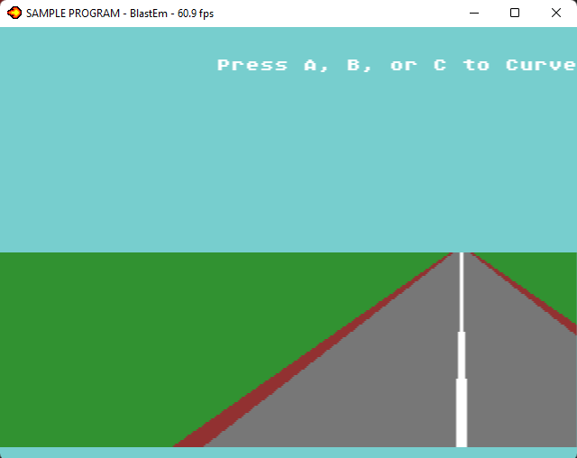
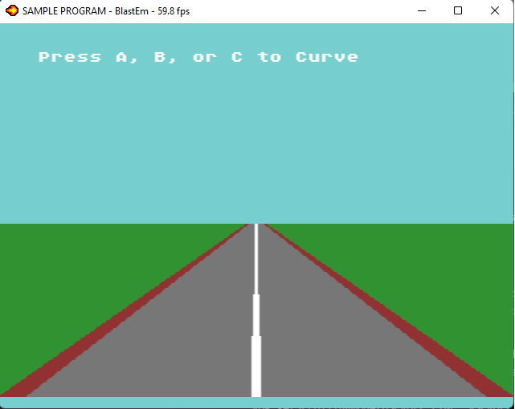
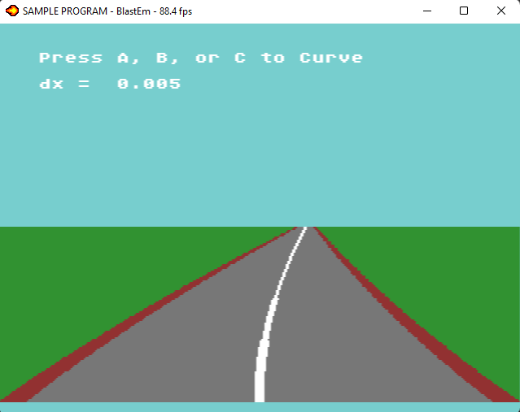

# Simple Curves
This code is based on the [Curves and Steering](http://www.extentofthejam.com/pseudo/#curves) section of [Lou's Pseudo 3d Page](http://www.extentofthejam.com/pseudo)

For simplicity I'm not bothering with multiple segments in this example.   

## The Road Image
I'm using a flat image of a road instead of drawing lines to denote the edge of the road and centerline. 

This image is 512 by 224 pixels.  This is much wider than the display (320x224).  The larger width lets me scroll the entire image left or right without wrapping around.  

Displaying the image is easy.  You define it in the `resource.res` file.
~~~res
IMAGE road "background/road.png" BEST
~~~

Then load it into scroll plane A with `VDP_drawImageEx()`
~~~c
	//////////////////////////////////////////////////////////////
	// Setup background A
	VDP_setPalette(PAL1, road.palette->data);
	int ind = TILE_USERINDEX;
	VDP_drawImageEx(BG_A, &road, TILE_ATTR_FULL(PAL1, FALSE, FALSE, FALSE, ind), 0, 0, FALSE, TRUE);
~~~

### Scrolling
The only problem with this is the image is much wider (512 pixels) than the screen (320 Pixels), so it'll be off-center.

To correct for this, we need to scroll the image to the left.
 In this case the amount to scroll is 
 ~~~c
 (512 - 320) /2
 ~~~
  or 96 pixels.  

In my code I define `SCROLL_CENTER` as -96 pixels.  -96 moves the image to the left.
~~~c
#define SCROLL_CENTER -96
~~~

I'm setting the scrolling mode to `HSCROLL_LINE`.  This is important for bending the road image to simulate curves.  `HSCROLL_LINE` lets us shift each line independently of each other.  `HSCROLL_PLANE` will scroll the entire plane and `HSCROLL_TILE` will scroll 8-pixel chunks.  

`HscrollA[]` is an 224 element array of a signed 16-bit ints.  Each element corresponds to a line on screen and holds the amount of pixels we want to scroll each line by.  To center the screen I'm initially setting them all to -96
~~~c
	VDP_setScrollingMode(HSCROLL_LINE, VSCROLL_PLANE);
	for (int i = 0; i < 224; i++)
	{
		HscrollA[i] = SCROLL_CENTER;
	}
~~~

The actual scrolling is performed by `VDP_setHorizontalScrollLine()` in the main loop. 
~~~c
		VDP_setHorizontalScrollLine(BG_A, 0, HscrollA, 224, DMA_QUEUE);
~~~

## Curves

Lou's pseudo code in [Curves and Steering](http://www.extentofthejam.com/pseudo/#curves) bends road segments using two values
* dx : Curve amount, constant per segment
* ddx : (*Cumulative*) Curve amount, changes per line

`dx` tells the program how far to shift each line as we move from the bottom of the screen to the top of the road. `ddx` accumulates the amount shifted so that each line up is shifted further than the previous line.

Since I'm not using multiple segments in this example, the curve can be created with a simple loop.  I'm moving from the bottom of the screen (224) to the top of the road in the background image (116).     The `current_x` value is added to the `SCROLL_CENTER` and stored in `HscrollA[]`.   
~~~c// Create example curves.
// dx: curve amount.  Constant over the image
void CreateCurve(fix32 dx)
{
	fix32 current_x = FIX32(0); // current x shift
	fix32 ddx = FIX32(0);				// Cumulative Curve amount. Changes every line

	// start from the bottom of the screen and move up to the top of the road.
	for (u16 bgY = 223; bgY >= 116; bgY--)
	{
		ddx = fix32Add(dx, ddx); // shift ddx by dx 
		current_x = fix32Add(current_x, ddx);
		HscrollA[bgY] = SCROLL_CENTER + fix32ToInt(current_x);
	}
}
~~~

The sign and magnitude of `dx` determines the direction and sharpness of a given curve.  

`dx = 0.005` 

`dx = -0.015` 

